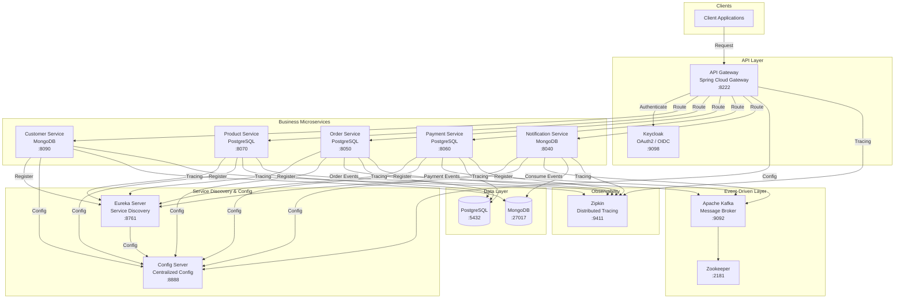

<p align="center">
  
  
  
  
  
  
  
  
</p>

---

# 🛒 E-Commerce Microservices Platform

A **cloud-native, event-driven e-commerce platform** built with **Spring Boot 3.2**, **Spring Cloud**, and **Apache Kafka**. This project demonstrates a modern microservices architecture with polyglot persistence, distributed tracing, service discovery, API gateway pattern, and OAuth2 authentication — all containerized with Docker.

> **Architecture Pattern:** Microservices (Domain-Driven Design)  
> **Infrastructure:** Containerized with Docker Compose  
> **Database Strategy:** Polyglot Persistence (PostgreSQL + MongoDB)

---

## 🏗 Architecture



---

## ✨ Features

- ✅ **Microservices Architecture** — Loosely coupled, independently deployable services
- 🔐 **OAuth2 / OpenID Connect** — Authentication & Authorization via **Keycloak**
- 🌐 **API Gateway** — Single entry point with **Spring Cloud Gateway** (port `8222`)
- 📍 **Service Discovery** — Dynamic service registration with **Netflix Eureka** (port `8761`)
- ⚙️ **Centralized Configuration** — Externalized config management via **Spring Cloud Config Server** (port `8888`)
- 🔄 **Event-Driven Communication** — Asynchronous messaging with **Apache Kafka**
- 🗄️ **Polyglot Persistence** — **PostgreSQL** (relational) + **MongoDB** (document-based)
- 📬 **Email Notifications** — Transactional emails with **Thymeleaf** templating + **MailDev**
- 🔍 **Distributed Tracing** — End-to-end request tracing with **Zipkin** + **Micrometer Brave**
- 🐳 **Full Dockerization** — All services containerized via **Docker Compose**
- 📊 **Database Administration** — **pgAdmin** + **Mongo-Express** web UIs
- 📄 **Database Migrations** — **Flyway** for PostgreSQL schema versioning

---

## 🧩 Microservices Breakdown

| Service | Port | Database | Description |
|---------|------|----------|-------------|
| **Config Server** | `8888` | — | Centralized configuration server (Spring Cloud Config) |
| **Discovery Server** | `8761` | — | Netflix Eureka service registry |
| **API Gateway** | `8222` | — | Spring Cloud Gateway with routing & security |
| **Customer Service** | `8090` | MongoDB | Customer management (CRUD, validation) |
| **Product Service** | `8070` | PostgreSQL | Product catalog with Flyway migrations |
| **Order Service** | `8050` | PostgreSQL | Order processing & Kafka event publishing |
| **Payment Service** | `8060` | PostgreSQL | Payment processing & Kafka event publishing |
| **Notification Service** | `8040` | MongoDB | Email notifications via Kafka consumer |

---

## 🛠 Tech Stack

### Languages & Runtimes
| Technology | Version |
|------------|---------|
| Java | 17 |
| Maven | 4.0+ |

### Frameworks & Libraries
| Framework | Version |
|-----------|---------|
| Spring Boot | 3.2.5 |
| Spring Cloud | 2023.0.1 |
| Spring Cloud Gateway | — |
| Spring Cloud Netflix Eureka | — |
| Spring Cloud Config | — |
| Spring Cloud OpenFeign | — |
| Spring Data JPA | — |
| Spring Data MongoDB | — |
| Spring Kafka | — |
| Spring Mail | — |
| Thymeleaf | — |
| Flyway | — |
| Lombok | — |

### Infrastructure & Middleware
| Service | Version | Purpose |
|---------|---------|---------|
| PostgreSQL | 16 | Relational database (Order, Product, Payment) |
| MongoDB | 7.0 | Document database (Customer, Notification) |
| Apache Kafka | 7.5.0 | Event streaming / message broker |
| Apache Zookeeper | 7.5.0 | Kafka coordination |
| Keycloak | 24.0.2 | OAuth2 / OIDC authentication server |
| Zipkin | Latest | Distributed tracing |
| MailDev | Latest | SMTP email testing server |
| pgAdmin | Latest | PostgreSQL admin web UI |
| Mongo-Express | Latest | MongoDB admin web UI |

### Observability
| Tool | Purpose |
|------|---------|
| Spring Actuator | Health checks & metrics |
| Micrometer Brave | Tracing instrumentation |
| Zipkin Reporter | Trace data export |
| Zipkin UI | Trace visualization |

---

## 🚀 Getting Started

### Prerequisites

- [Java 17+](https://adoptium.net/)
- [Maven 3.8+](https://maven.apache.org/)
- [Docker Desktop](https://www.docker.com/products/docker-desktop/)
- [Git](https://git-scm.com/)

### 🔧 Running the Application

#### 1. Clone the repository

```bash
git clone https://github.com/PagarciaSima/MicroServices---Ecommerce-Spring-Boot-26-04-26.git
cd e-commerce-microservices
```

#### 2. Start Infrastructure (Docker)

```bash
docker compose up -d
```

This starts all infrastructure services:
- PostgreSQL (`:5432`)
- MongoDB (`:27017`)
- pgAdmin (`:5050`)
- Mongo-Express (`:8081`)
- Zookeeper (`:22181`)
- Kafka (`:9092`)
- Zipkin (`:9411`)
- MailDev (`:1080`)
- Keycloak (`:9098`)

#### 3. Start Microservices

Build and start each service in order:

```bash
# 1. Config Server
cd config-server
mvn spring-boot:run

# 2. Discovery Server
cd discovery
mvn spring-boot:run

# 3. Gateway
cd gateway
mvn spring-boot:run

# 4. Business Services
cd customer
mvn spring-boot:run

cd product
mvn spring-boot:run

cd order
mvn spring-boot:run

cd payment
mvn spring-boot:run

cd notification
mvn spring-boot:run
```

---

## 📡 System Ports Reference

| Component | Port | URL |
|-----------|------|-----|
| API Gateway | `8222` | http://localhost:8222 |
| Eureka Dashboard | `8761` | http://localhost:8761 |
| Config Server | `8888` | http://localhost:8888 |
| Customer Service | `8090` | http://localhost:8090 |
| Product Service | `8070` | http://localhost:8070 |
| Order Service | `8050` | http://localhost:8050 |
| Payment Service | `8060` | http://localhost:8060 |
| Notification Service | `8040` | http://localhost:8040 |
| PostgreSQL | `5432` | `jdbc:postgresql://localhost:5432/` |
| MongoDB | `27017` | `mongodb://localhost:27017/` |
| PgAdmin UI | `5050` | http://localhost:5050 |
| Mongo-Express UI | `8081` | http://localhost:8081 |
| Kafka | `9092` | `localhost:9092` |
| Zookeeper | `22181` | `localhost:22181` |
| Zipkin UI | `9411` | http://localhost:9411 |
| MailDev UI | `1080` | http://localhost:1080 |
| MailDev SMTP | `1025` | — |
| Keycloak | `9098` | http://localhost:9098 |

---

## 📬 Event-Driven Flow (Kafka)

```
Order Service (Producer)          Payment Service (Producer)
        │                                │
        │  order.created                 │  payment.completed
        ▼                                ▼
┌──────────────────────────────────────────────────┐
│                    KAFKA                          │
│  Topics: order-created, payment-completed, ...    │
└──────────────────────────────────────────────────┘
        │                                │
        │                                │
        ▼                                ▼
Notification Service (Consumer)     Order Service (Consumer)
        │                                │
        ▼                                ▼
   Email (MailDev)                 Update Order Status
```

---

## 📂 Project Structure

```
e-commerce-microservices/
├── config-server/              # Spring Cloud Config Server (port 8888)
│   ├── src/
│   └── pom.xml
├── discovery/                  # Netflix Eureka Service Registry (port 8761)
│   ├── src/
│   └── pom.xml
├── gateway/                    # Spring Cloud Gateway (port 8222)
│   ├── src/
│   └── pom.xml
├── customer/                   # Customer Service (port 8090) — MongoDB
│   ├── src/
│   │   ├── main/
│   │   │   ├── java/com/pgs/ecommerce/
│   │   │   │   ├── controller/
│   │   │   │   ├── dto/
│   │   │   │   ├── entity/
│   │   │   │   ├── exception/
│   │   │   │   ├── mapper/
│   │   │   │   ├── repository/
│   │   │   │   └── service/
│   │   │   └── resources/
│   │   └── test/
│   └── pom.xml
├── product/                    # Product Service (port 8070) — PostgreSQL + Flyway
│   ├── src/
│   └── pom.xml
├── order/                      # Order Service (port 8050) — PostgreSQL + Kafka
│   ├── src/
│   └── pom.xml
├── payment/                    # Payment Service (port 8060) — PostgreSQL + Kafka
│   ├── src/
│   └── pom.xml
├── notification/               # Notification Service (port 8040) — MongoDB + Kafka
│   ├── src/
│   └── pom.xml
├── docker-compose.yml          # Infrastructure container orchestration
└── README.md
```

---

## 🔗 API Endpoints (via Gateway)

Base URL: `http://localhost:8222`

### Customer Service
| Method | Endpoint | Description |
|--------|----------|-------------|
| `GET` | `/api/v1/customers` | List all customers |
| `GET` | `/api/v1/customers/{id}` | Get customer by ID |
| `POST` | `/api/v1/customers` | Create customer |
| `PUT` | `/api/v1/customers/{id}` | Update customer |
| `DELETE` | `/api/v1/customers/{id}` | Delete customer |

### Product Service
| Method | Endpoint | Description |
|--------|----------|-------------|
| `GET` | `/api/v1/products` | List all products |
| `GET` | `/api/v1/products/{id}` | Get product by ID |
| `POST` | `/api/v1/products` | Create product |
| `PUT` | `/api/v1/products/{id}` | Update product |
| `DELETE` | `/api/v1/products/{id}` | Delete product |

### Order Service
| Method | Endpoint | Description |
|--------|----------|-------------|
| `GET` | `/api/v1/orders` | List all orders |
| `GET` | `/api/v1/orders/{id}` | Get order by ID |
| `POST` | `/api/v1/orders` | Create order |

### Payment Service
| Method | Endpoint | Description |
|--------|----------|-------------|
| `GET` | `/api/v1/payments` | List all payments |
| `GET` | `/api/v1/payments/{id}` | Get payment by ID |
| `POST` | `/api/v1/payments` | Process payment |

---

## 🧪 Architecture Highlights

### 🔐 Security
Authentication and authorization are handled by **Keycloak**, an OAuth2 / OpenID Connect identity provider. The API Gateway validates JWT tokens before routing requests to downstream services.

### 🌐 Service Discovery
**Netflix Eureka** enables dynamic service registration and discovery. Services register themselves at startup and clients discover them via logical names rather than hardcoded URLs.

### ⚙️ Configuration Management
All microservices fetch their configuration from the **Spring Cloud Config Server**, enabling centralized management and hot-reloading without rebuilding.

### 🔄 Event-Driven Communication
**Apache Kafka** decouples services and enables reliable asynchronous communication:
- `Order Service` publishes `order-created` events
- `Payment Service` publishes `payment-completed` events
- `Notification Service` consumes events to send emails

### 🔍 Distributed Tracing
**Zipkin** with **Micrometer Brave** traces requests across service boundaries, providing end-to-end visibility into request flows and helping diagnose latency issues.

### 🗄️ Polyglot Persistence
- **PostgreSQL** handles transactional/relational data (Orders, Products, Payments)
- **MongoDB** handles document-oriented data (Customers, Notifications)

---

## 📧 Email Notifications

The Notification Service uses:
- **Spring Mail** for SMTP email sending
- **Thymeleaf** for HTML email templates
- **MailDev** as a local SMTP test server (UI at `http://localhost:1080`)

---

## 📄 License

This project is licensed under the **MIT License** — see the [LICENSE](LICENSE) file for details.

---

<p align="center">
  Built using <strong>Spring Boot</strong> & <strong>Spring Cloud</strong>
</p>